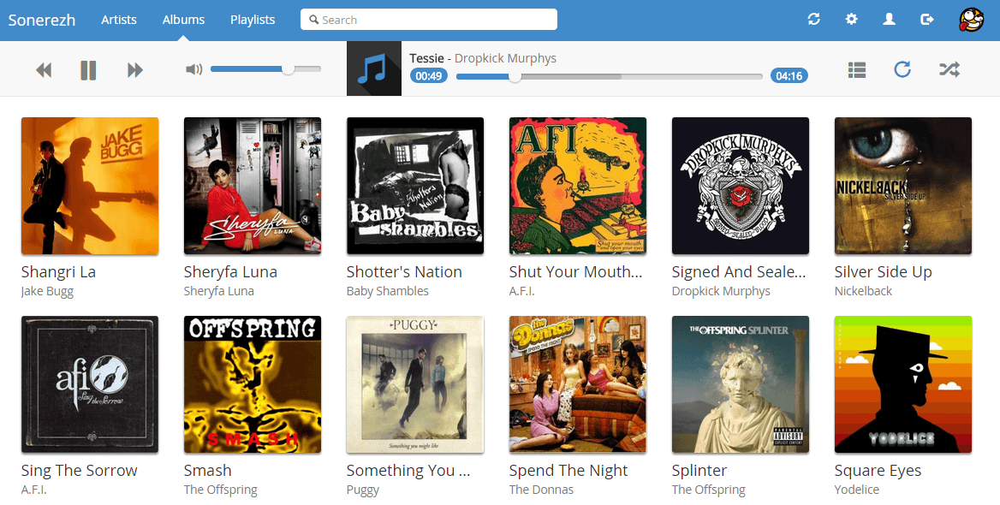
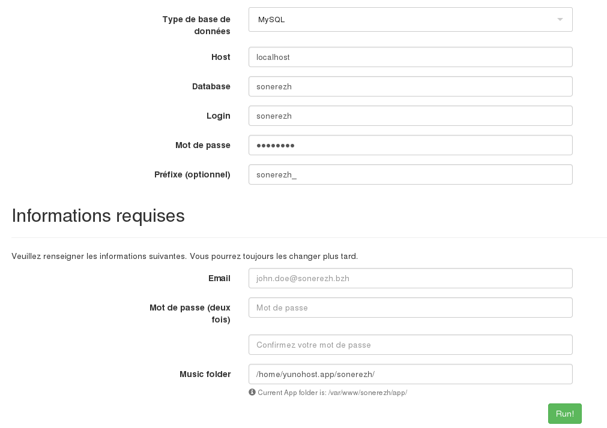

# Sonerezh for YunoHost

[](https://dash.yunohost.org/appci/app/sonerezh)    
[](https://install-app.yunohost.org/?app=sonerezh)

*[Lire ce readme en français.](./README_fr.md)*

> *This package allows you to install Sonerezh quickly and simply on a YunoHost server.  
If you don't have YunoHost, please consult [the guide](https://yunohost.org/#/install) to learn how to install it.*

## Overview
Quick description of this app.

**Shipped version:** 1.2.6

## Screenshots


## Demo

* [Official demo](https://www.sonerezh.bzh/demo/login)

## Configuration

How to configure this app: From an admin panel, a plain file with SSH, or any other way.

## Documentation

 * Official documentation: Link to the official documentation of this app
 * YunoHost documentation: If specific documentation is needed, feel free to contribute.

## YunoHost specific features

#### Multi-user support

Are LDAP and HTTP auth supported?
Can the app be used by multiple users?

#### Supported architectures

* x86-64 - [](https://ci-apps.yunohost.org/ci/apps/sonerezh/)
* ARMv8-A - [](https://ci-apps-arm.yunohost.org/ci/apps/sonerezh/)

## Limitations

* Any known limitations.

## Additional information

* Other info you would like to add about this app.

## Links

 * Report a bug: https://github.com/YunoHost-Apps/sonerezh_ynh/issues
 * App website: https://www.sonerezh.bzh/
 * Upstream app repository: https://github.com/sonerezh/sonerezh
 * YunoHost website: https://yunohost.org/

---

## Developer info

Please send your pull request to the [testing branch](https://github.com/YunoHost-Apps/sonerezh_ynh/tree/testing).

To try the testing branch, please proceed like that.
```
sudo yunohost app install https://github.com/YunoHost-Apps/sonerezh_ynh/tree/testing --debug
or
sudo yunohost app upgrade sonerezh -u https://github.com/YunoHost-Apps/sonerezh_ynh/tree/testing --debug
```





## Postinstallation
Currently, you will have to do manually postinstallation.
There is [an issue](https://github.com/YunoHost-Apps/sonerezh_ynh/issues/1) to solve that issue. But I wasn't able to solved it.

You will have to go to `/sonerezh/install/` and put this parameters:

- Retrieve database password:
```bash
sudo cat /etc/yunohost/apps/sonerezh/settings.yml | grep mysql
```
- Put your email and password to create an account.



## Music
Actually, sonerezh do not provide a web interface to upload music.
You have to store your music in `/home/yunohost.app/sonerezh`.
sonerezh will update your music.


